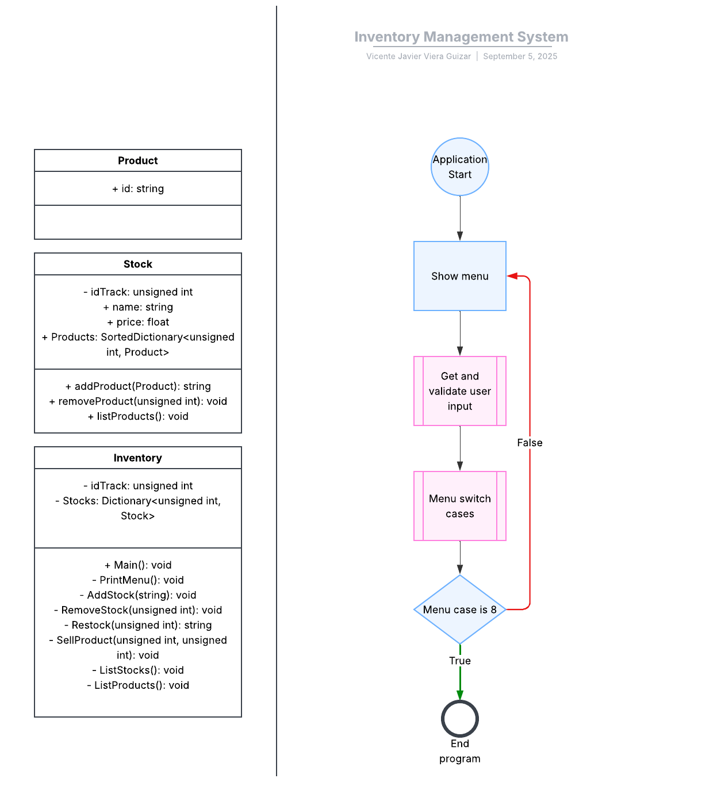
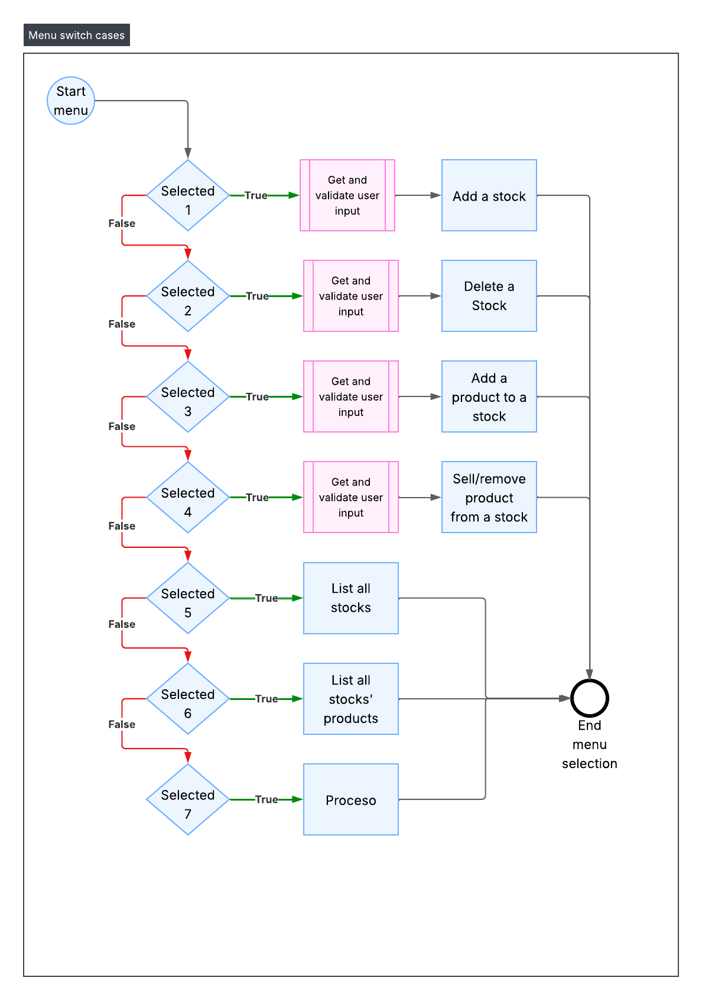
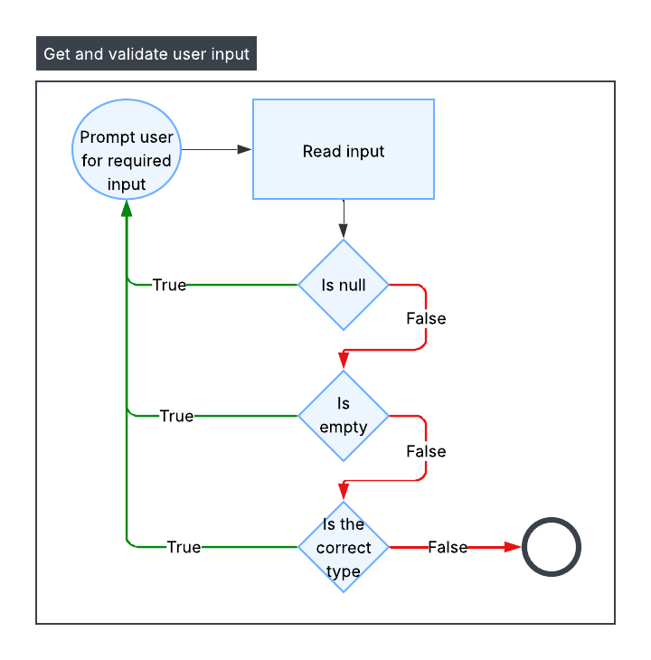

Project: Inventory management system
=====================================
Vicente Javier Viera Guizar

Functional Requirements
----------------------------------
- Create new stocks.
- Add new products to a stock.
- Sell stocks' products.
- Restock stocks' products.
- View all stocks.
- View all stocks' products.
- Show an interactive terminal GUI to interact with the inventory.

Non-Functional Requirements
----------------------------------
- Local use with only one user.
- Non concurrent execution.
- Non parallelization in execution.
- Non persistent data storage.
- Strict data validation.
- Decimal price >= 0 and integer non negative stock >= 0.
- No external commands execution.
- Handle users' inputs through keyboard.

Project Objectives
----------------------------------
Develop a flash GUI terminal inventory management program to keep track of inventory operations and movements.

Design Outline
----------------------------------

Design Modules
----------------------------------

